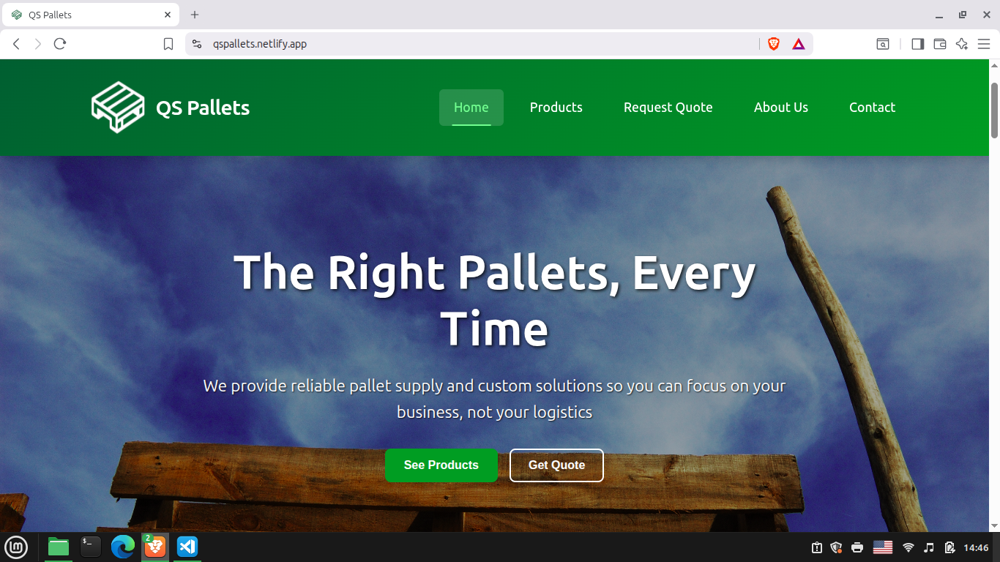
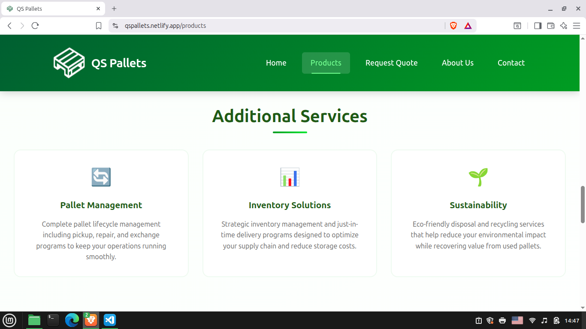
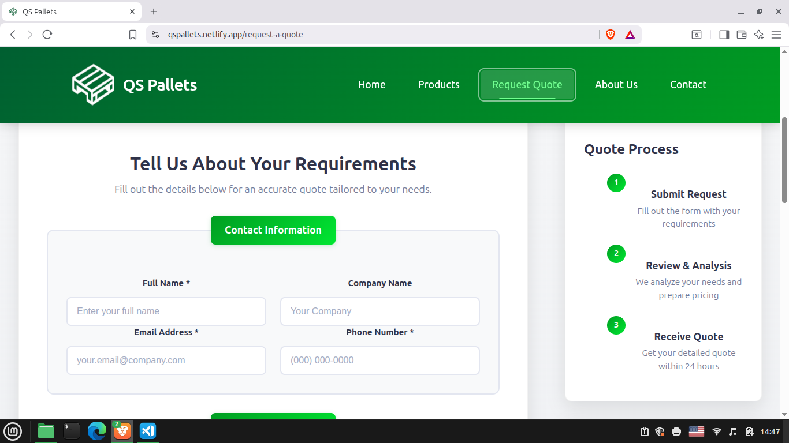
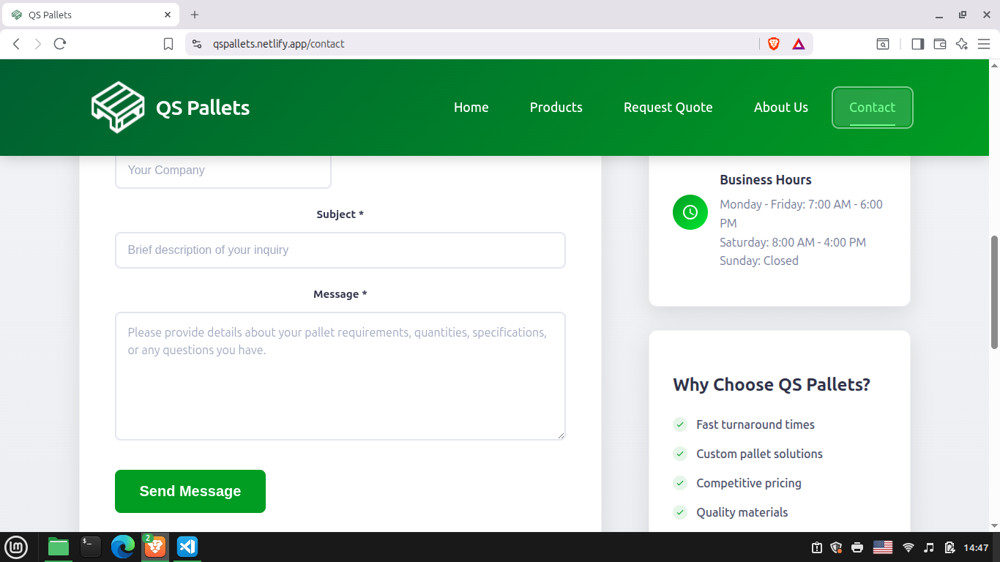

# QS Pallets

**QS Pallets** is a responsive business website built with **React** as the company’s first online presence. The site allows clients to explore the company’s product catalog, view detailed product information, and submit inquiries through interactive forms.

The frontend includes two key features for customer interaction:

- A **quote request form**, enabling clients to request a free quote tailored to their specific needs.
- A **contact form**, giving visitors a direct way to ask questions or request additional information.

This project demonstrates skills in:

- **React development** with reusable components
- **Responsive UI design** for desktop and mobile
- **Form handling and client-side validation**
- **Integration-ready architecture**, prepared to connect with a backend API (in a separate repository)
- **Deployment setup with Netlify** (to host the frontend)

With a clean design and practical features, QS Pallets provides a foundation for the company’s online presence and a professional, accessible way for clients to view products and connect with the business.

## Features

- Responsive layout for desktop and mobile
- Product catalog with detailed product pages
- Quote request form with custom input fields
- Contact form for general inquiries
- Built entirely with React components
- Deployed on Netlify

## Tech Stack

- Frontend: React
- Routing: React Router
- Deployment: Netlify

## Live Demo

[QS Pallets](https://qspallets.com/)

## Screenshots

## Contact

Created by [Hugo Quezada](https://www.linkedin.com/in/hugo-quezada-7059091b6/)
